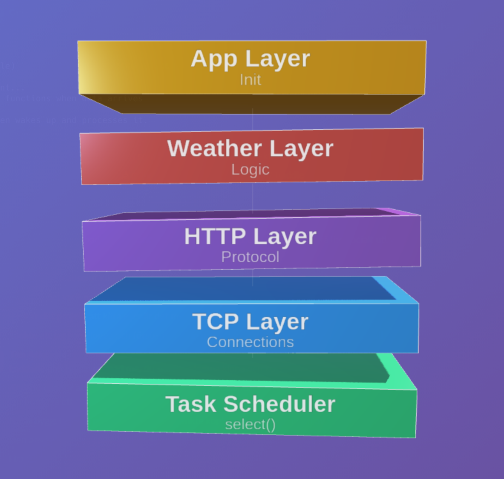

# weather_appv2

A Chas Academy school project: SUVX25 for learning object pattern in C.

## About

A simple HTTP server built in C for embedded systems.

**Key Features:**
- Waits for network activity using `select()` instead of constantly checking
- All memory allocated at startup - no surprises at runtime
- Non-blocking connections - server never freezes
- Handles up to 32 connections at once (configureable)
- Clean layered design: TCP → HTTP → Weather
- Uses almost no CPU when idle (~0.1%)

### Layered Architecture
**App Layer**
-Container that holds and initializes all layers. Coordinates the entire system.

**Weather Layer (Work in Progress)**
- weather_server_t: Manages weather business logic and connection pool
- weather_connection_t[32]:  Fixed pool for API calls and data processing
- Handles weather-specific operations (future: external API integration)

**HTTP Layer**
- http_server_t: Manages HTTP connection pool and protocol handling
- http_connection_t[32]: Fixed pool for HTTP request/response processing
- Parses HTTP requests and formats responses
- Forwards processed requests to Weather layer (future callback)

**TCP Layer**
- tcp_server_t: Listens for incoming connections on port 8080
- Non-blocking accept loop
- Forwards new connections to HTTP layer via callback

**Task Scheduler**
- Central event loop using select() for I/O monitoring
- Calls work() on registered tasks:
  - tcp_server - accepts new connections
  - weather_connection[0..31] - processes weather logic
  - http_connection[0..31] - handles HTTP I/O



## Usage

**Build:**
```bash
make
```

**Run:**
```bash
./weather_app
```

**Test:**
```bash
curl http://localhost:8080
```

**Clean:**
```bash
make clean
```
